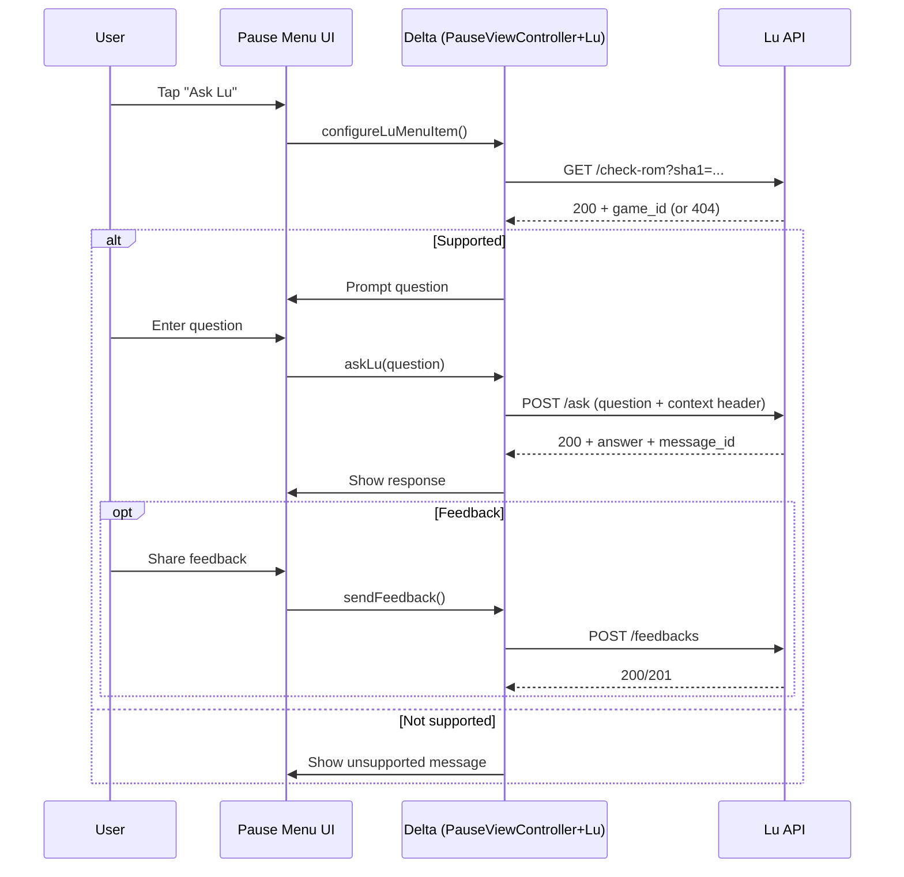
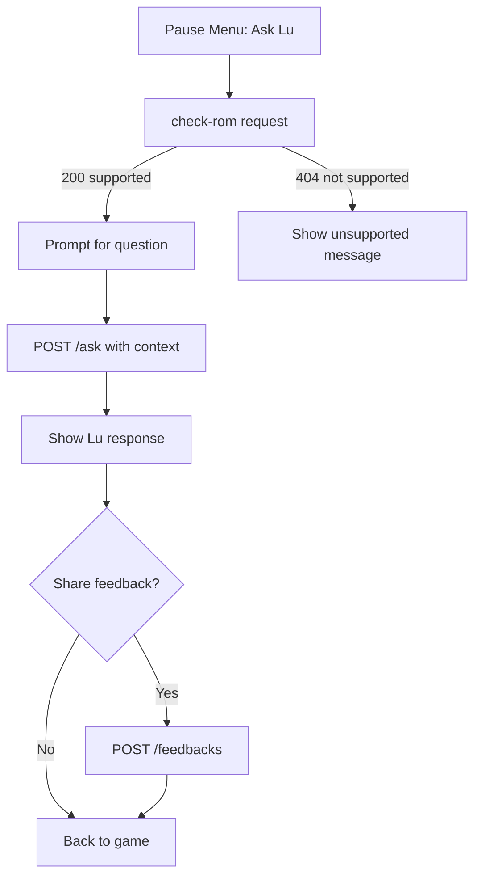

# Lu Integration Guide

This document explains how the Lu integration works in Delta, how to set up the project for the first time, and how to test Lu on simulator and devices.

## Where Lu Lives in the Codebase

- Feature flag + options: `Delta/Experimental Features/Features/Lu.swift`
- Feature registration: `Delta/Experimental Features/ExperimentalFeatures.swift`
- UI entry point: `PauseViewController` adds **Ask Lu** in the Pause Menu
  - Implementation: `Delta/Extensions/PauseViewController+Lu.swift`
- Lu configuration: `Delta/Supporting Files/Lu-Info.plist`

## Feature Gating

Lu is an Experimental Feature. The availability gate is implemented in `PurchaseManager`:

- If `BETA` is defined, Experimental Features are always available.
- Otherwise, features require active patron or an eligible in-app purchase.

For local testing, ensure `SWIFT_ACTIVE_COMPILATION_CONDITIONS` includes `BETA` for your build configuration.
## Authentication & Headers

Lu requests are **unauthenticated** in the current implementation. There is no token or API key included in requests.

All Lu requests include a JSON-encoded context header:

- Header name: `x-lu-context`
- Value: JSON string (device + game context)

Example header value (line breaks added for readability):

```json
{
  "device_context": {
    "device_id": "A1B2C3D4-...-E5F6",
    "device_name": "John’s iPhone",
    "system_name": "iOS",
    "system_version": "17.5",
    "model": "iPhone",
    "bundle_id": "com.playwithlu.delta.lu"
  },
  "game_context": {
    "name": "The Legend of Zelda: Ocarina of Time",
    "identifier": "ABCD1234...",
    "type": "n64",
    "save_states_count": 3,
    "cheats_count": 0,
    "last_played": "2026-01-22T18:12:10Z"
  }
}
```

The header is constructed in `Delta/Extensions/PauseViewController+Lu.swift` by `createAPIContext(...)` and attached via `URLRequest.addContextHeaders(...)`.

## Runtime Configuration

`Lu-Info.plist` provides:

- `LU_BASE_URL` (base URL for Lu API)
- `SUPPORT_TIMEOUT` (check-rom timeout)
- `ASK_TIMEOUT` (ask endpoint timeout)
- `FEEDBACK_TIMEOUT` (feedback endpoint timeout)
### Default Values

From `Delta/Supporting Files/Lu-Info.plist`:

- `LU_BASE_URL`: `https://api.lulabs.ai/delta`
- `SUPPORT_TIMEOUT`: `10`
- `ASK_TIMEOUT`: `30`
- `FEEDBACK_TIMEOUT`: `10`

## Lu Workflow (High Level)

1. User opens Pause Menu and taps **Ask Lu**.
2. App calls `check-rom` to see if the game is supported.
3. If supported, app prompts for a question.
4. App sends `ask` request with question + context header.
5. App shows response and optional feedback flow.

## First Activation Behavior

The first time a user taps **Ask Lu**, a welcome message is displayed:

- Text includes Terms/Privacy notice and the static link `https://lulabs.ai/legal`.
- After acknowledging, the “didShowWelcomeMessage” option is set to true.

On subsequent uses, the welcome message is skipped and the question prompt is shown immediately.

## Static Links Used

From `PauseViewController+Lu.swift`:

- `https://lulabs.ai/legal`
- `https://discord.gg/XvSysJpQrn`

These appear in the Lu feature description and first-use alert.

### Sequence Diagram



### Workflow Diagram



## API Details (In-App)

Endpoints used:

- `GET {LU_BASE_URL}/check-rom?sha1=<game_sha1>`
- `POST {LU_BASE_URL}/ask`
- `POST {LU_BASE_URL}/feedbacks`

Request header:

- `x-lu-context`: JSON-encoded device + game context:
  - Device: device ID/name/system/model/bundle id
  - Game: name/identifier/type/save state count/cheat count/last played
### Request/Response Schemas

**Check game support**

Request:

```http
GET /check-rom?sha1=<ROM_SHA1>
x-lu-context: <json string>
```

Response (200):

```json
{
  "game_id": "some-game-id"
}
```

Response (404): no body required (treated as unsupported game).

**Ask Lu**

Request body:

```json
{
  "game_id": "some-game-id",
  "question": "How do I beat the first boss?",
  "remember_conversation": true
}
```

Response:

```json
{
  "message_id": "abc123",
  "answer": "Try using the boomerang to stun the boss..."
}
```

**Feedback**

Request body:

```json
{
  "message_id": "abc123",
  "feedback": "POSITIVE",
  "feedback_message": "Helpful and accurate!"
}
```

Response (200 or 201): treated as success.

### UI/UX Changes

- Adds **Ask Lu** item to the Pause Menu.
- On first activation, shows a Terms/Privacy notice.
- Shows question prompt, “Lu is thinking…” loading state, and response modal.
- Optional feedback flow with thumbs up/down and optional text input.

## Local Setup (First Time)

1. Ensure Git LFS is installed.
2. Clone repo and init submodules:
   - `git submodule update --init --recursive`
3. Install pods and open workspace:
   - `pod install`
   - Open `Delta.xcworkspace` (not the .xcodeproj)
4. In Xcode: **File → Packages → Reset Package Caches**, then **Resolve Package Versions**.
5. Set your Development Team in:
   - `Delta` target
   - `Systems` target
   - Subproject targets (e.g., GPGXDeltaCore, MelonDSDeltaCore)
   - Team used for Lu integration builds: `GMPQ6V965Q` (PlayWithLu)
6. Set unique bundle identifiers (e.g., `com.playwithlu.delta...`).
7. Build the **Delta** scheme.

### Submodule Forks (When Needed)

Some team ID fixes live inside submodules (e.g., GPGXDeltaCore, MelonDSDeltaCore). If you want those fixes shared across the team, you must:

1. Fork the submodule repositories under the playwithlu org.
2. Add remotes in each submodule pointing to the fork (e.g., `origin` → playwithlu fork).
3. Commit changes **inside** the submodule and push to the fork.
4. Update the parent repo to point to the new submodule commit SHAs.

If you don’t do this, contributors will still need to set their local team ID manually in those submodules.

## Testing Lu

### Simulator
- Lu uses network calls; ensure the simulator has internet access.
- Use the Pause Menu during gameplay and tap **Ask Lu**.
- If `remember conversations` is enabled, responses will note persistence.

### Local iPhone/iPad
- Ensure signing is valid for device build.
- Build and run **Delta** on device.
- Open a game → Pause Menu → **Ask Lu**.
- Check that `check-rom` succeeds and the response is shown.

## Troubleshooting

- **Missing package product** errors: make sure you open `Delta.xcworkspace` and reset/resolve packages.
- **Experimental Features locked**: confirm `BETA` is in build settings or that you have valid patron access.
- **Lu not responding**: verify `LU_BASE_URL` in `Lu-Info.plist` and network connectivity.

## Project Notes

### Package.resolved

`Delta.xcworkspace/xcshareddata/swiftpm/Package.resolved` is present. For Xcode + SwiftPM projects, it’s standard to **commit Package.resolved** so everyone resolves the same dependency versions. The current `.gitignore` does not ignore it, and that is typical for apps.

Recommendation: **keep it committed** unless you intentionally want floating dependency versions for all developers (not typical).
